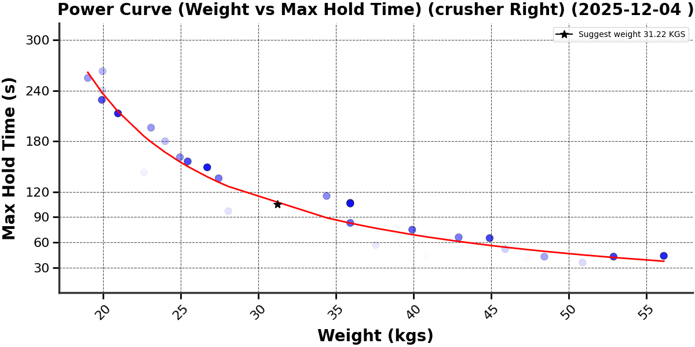
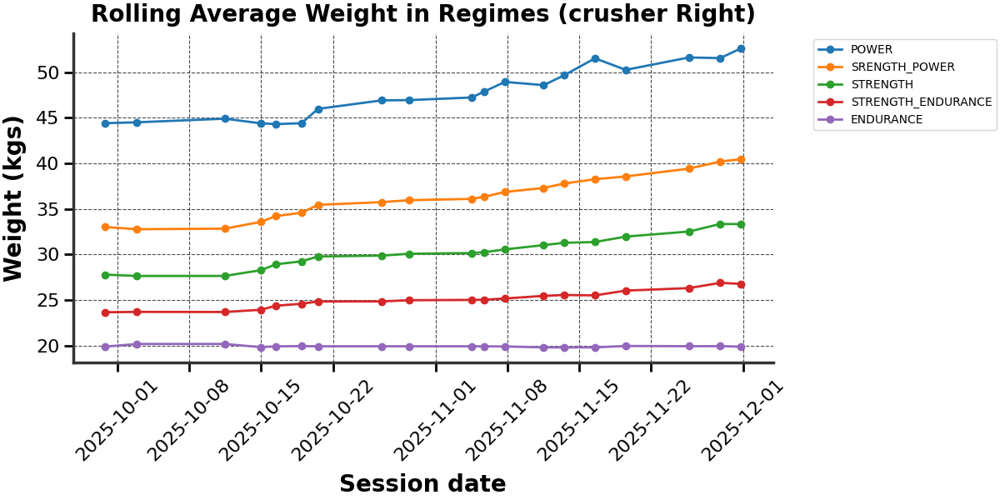
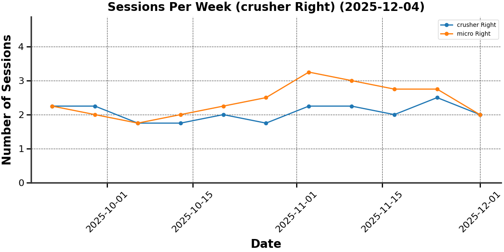

# Hog Data Tool

A Python project for loading and visualizing HOG grip training session data.  

current capabilities
- load hog data into a structured format for easy access and analysis `StructuredHogData`.
- Easy access grouped Session data (i.e micro right hand) with some additional computed features, `FullSessionData`
- Filtering of sessions (i.e include sessions 10 to current) allowing for some simple visualisations pre hatching.
- bulk plotting methods across all gripper types and hands.
- basic curve fitting (hyperbolic)
- simple set of visualisations
    - power and inverted power curves
    - next weight suggestions based on least dense regions of power curve
    - session frequency and session gaps
    - rolling average weight of each regieme (power, strength, endurance etc)
    
---

## Setup

1. **Environment**  

   Copy `env.shared` to `.env.local` and update paths and settings:  

   ```text
   INPUT_DATA_PATH=./data/hog_data.csv # path to hog data
   OUTPUT_DATA_PATH=./data/outputs/ # path output plotd saved to
   WEIGHT_UNIT=lbs #lbs or kgs

2. **Install dependencies**

    simply call `poetry install` and poetry will install the dependencies to your venv.

---

## Running the project

Run the main data pipeline `make run`

This will

1. Load the CSV from `INPUT_DATA_PATH`.

2. Create plots for all grippers:
    - Power curves (plot_power_curve)
    - Inverted power curves (plot_inverted_power_curve)
    - Session gaps (plot_session_gap)
    - Session frequency (plot_session_frequency)
    - Rolling average weight in regimes (plot_rolling_average_weight_in_regimes)

3.  Save outputs to `OUTPUT_DATA_PATH`.

---

## Loading data

Data can be loaded directly in Python:

```
from hog_data_tool import StructuredHogData, EnvConfig, get_env_config

config = get_env_config()
data = StructuredHogData.from_csv(config.input_data_path)
```

---

## Plotting

You can generate plots programmatically:

```
# Plot per gripper
data.create_plot_for_all_grippers(plot_method=plot_power_curve, output_path=config.output_data_path / "power_curve")

# Plot shared data (all right hands by default)
data.create_shared_gripper_plot(plot_method=plot_session_gap, output_path=config.output_data_path / "session_gap")

```

You can create your own plotting functions, note all plotting functions must follow the SessionPlotMethod or SharedSessionPlotMethod signature.
"""

---

## Curve fitting

- Basic hyperbolic curve fitting is included (`fit_power_curve_with_hyperbolic_decay`).
- Piecewise curve fitting will be added in future updates.


---

## Example plots






